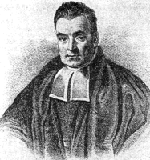
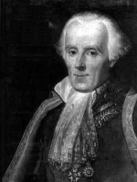
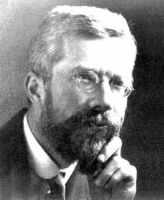
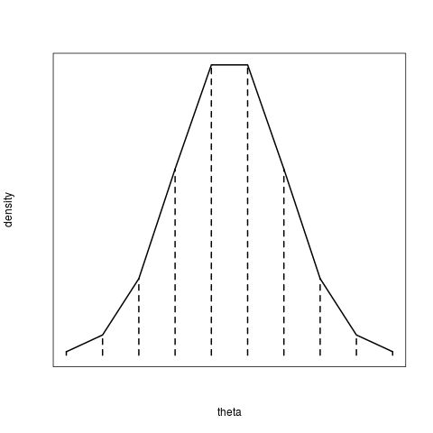
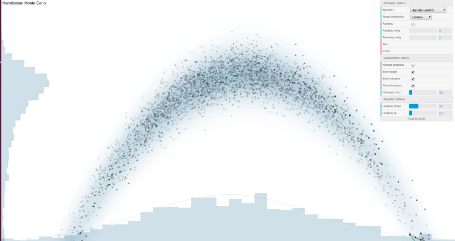

```{r setup, include=FALSE}
knitr::opts_chunk$set(echo = FALSE)
```


## What's wrong with max. likelihood?

> - $p(y|\theta)$ is a probability function for the data $y$ given the parameters $\theta$ 
> - Inference on parameters, e.g. $P(\theta>0)$, not straightforward possible using $p(y|\theta)$   
> - But the data is already observed, we don't want to calculate probabilities for $y$
> - What we actually want is probability of parameters $\theta$ given the observed data $y$
> - Or: what does the data tell us about our model?
> - We need $p(\theta|y)$ !


## What's wrong with P-values? {.build}

> - $p(y|\theta)$ is a probability function for the data $y$ given the parameters $\theta$
> - calculation of $P(\theta>0)$ or $P(\theta=0)$ not possible
> - so what does the P-value mean?

workaround: 

> - transform data to a single value $T(y)$ with teststatistic $T$
> - assume parameter was actually zero ($H_0:\theta=0$)
> - calculate probability for any data being different from observed data $P(T(\tilde y)>T(y)|\theta=0)$ (that's the P-value)
> - if this is small, reject null-hypothesis $H_0$

Does this procedure sound weird? Let's check out $p(\theta|y)$ now!


## What are we interested in? {.build}

### Example: linear regression
$y_i \sim \text{normal}(\mu_i,\sigma)\quad i=1,...,n$  
$\mu_i = a+b\cdot x_i$

> - interested in effect, i.e. slope $b$
> - what do the data tell me about the slope? (evidence)
> - probability distribution $p(b|y)$ **given the data**
> - mean estimate, confidence intervals, $P(b>0)$, ...
> - no P-values needed
> - **direct inference** instead


## Bayes rule

For observed data $y$ and model parameters $\theta$

$$p(\theta|y)=\frac{p(\theta)\cdot p(y|\theta)}{p(y)}$$

> - $p(\theta|y)$ posterior distribution
> - $p(\theta)$ prior distribution
> - $p(y|\theta)$ likelihood function
> - $p(y) = \int_\theta p(\theta) p(y|\theta) d\theta$ just a normalization constant, independent of actual $\theta$

## Bayes rule

posterior is proportional to ("$\varpropto$") prior times likelihood!

$$p(\theta|y)\varpropto p(\theta)\cdot p(y|\theta)$$


```{r posterior, fig.height=4.5, fig.width=6, fig.align="left"}
x=seq(-10,10, by=0.01)
prior=dnorm(x, mean=0, sd=4)
likelihood=dnorm(x, mean=2, sd=1.5)
par(mfrow=c(1,1), mar=c(4,4,1,1), oma=c(1,0,0,0))
plot(x,prior, type="l", col="blue", ylim=c(0,0.3), lwd=2, lty=2, xlab=expression(theta), ylab=("density"))
lines(x,likelihood, col="red", lwd=2, lty=2)
lines(x,prior*likelihood/sum(prior*likelihood)*100, col="purple", lwd=2)
legend("topleft",legend=c("prior", "likelihood", "posterior"), lty=c(1,1,1), lwd=c(2,2,2), col=c("blue","red","purple"))
```

## Bayes rule

posterior is proportional to ("$\varpropto$") prior times likelihood!

$$p(\theta|y)\varpropto p(\theta)\cdot p(y|\theta)$$

> - prior: a-priori information of the model parameters
> - likelihood: information of the data
> - posterior: updated information of the model parameters given the data

## Excursion: some history

  

> - **1700s** Bayes, Laplace
> - **early 1900s** Fisher: frequentism, maximum likelihood
> - **mid -- late 1900s** MCMC algorithms (Metropolis-Hastings, Gibbs sampling, Hamiltonian MC)
> - **2000s** computational methods for MCMC  
    (BUGS, JAGS, Stan, ...)

## Posterior: local or global? {.build}

### local approach

- find $\theta$ that maximizes $P(\theta|y)$
- analogue to maximum likelihood
- maximum a posteriori estimate (MAP)
- **mode** of posterior distribution

### global approach

- explore $P(\theta|y)$ in whole parameter space
- compute all statistics: mean, sd, CIs, $P(\theta>0)$, $P(a<\theta<b)$, ...
- **but how to evaluate $P(\theta|y)$ globally?**

## The curse of dimensionality | Naive approach e.g.: sampling with grids

statistical model with 1 parameter:  
evaluate $P(\theta|y)$ "globally" in $m=10$ locations  

<!--  --> 

```{r curse 1d, fig.height=4.5, fig.width=6, fig.align="left"}
x=seq(-3,3, length.out=10)
p=dnorm(x, mean=0, sd=1)
par(mfrow=c(1,1), mar=rep(0,4), oma=c(4,4,0,2))
plot(x,p, type="l", ylim=c(0,max(p)),
     xlab="", ylab="",
     xaxt="n",
     yaxt="n",
     lwd=2,
     lty=2
     )
mtext("theta", side=1, line=1)
mtext("density", side=2, line=1)
for (i in 1:length(x)){
  lines(c(x[i],x[i]),c(0,p[i]), lwd=2, lty=1)
}
```

## The curse of dimensionality | Naive approach e.g.: sampling with grids

statistical model with 2 parameters:  
evaluate $P(\theta|y)$ "globally" in $m\cdot m=10\cdot10=100$ locations  

```{r curse 2d, fig.height=4.5, fig.width=6, fig.align="left"}
library("plot3D")
x=seq(-2,2, length.out=10)
y=x
xy=expand.grid(x=x,y=y)
p = with(xy, exp(-x^2-y^2))
par(mfrow=c(1,1), mar=rep(0,4), oma=c(4,4,0,2))
persp(x=x, 
      y=y, 
      z=matrix(p,length(x),length(x)),
      xlab=expression(theta1),
      ylab=expression(theta2),
      zlab="density",
      theta = -30, 
      phi = 30,
      lwd=2)
```


## The curse of dimensionality | Naive approach e.g.: sampling with grids {.build}

statistical model with $n$ parameters:  
evaluate $P(\theta|y)$ "globally" in $m^n$ locations  

- models with e.g. $n=20$ parameters out of reach! 
- (and $m=10$ evaluations per dimension is still quite coarse)
- CPU time = millions of years
- grids perform many evaluations where probability density is low ("empty space")

**We need a more efficient sampling strategy!**


## Markov Chain Monte Carlo (MCMC) {.build}

**Monte Carlo:** each iteration/sample is drawn randomly  
    (with some rule)

**Markov:** each new sample depends only on the last one,
iterative routine

**Chain:** list of samples

- this rule is specified such that  
    - many samples are drawn where $P(\theta|y)$ is high and  
    - few samples are drawn where $P(\theta|y)$ is low

- **chain represents a random draw from the posterior distribution!!**

## Markov Chain Monte Carlo (MCMC)

let's see some example. 

follow the link and choose from different MCMC algorithms and several targets (i.e. posteriors to be explored)

https://chi-feng.github.io/mcmc-demo/app.html#RandomWalkMH,banana 

- These are all 2d examples. 
- Compare the 1d marginal distributions on the bottom and on the left with the complete 2d representation. 
- Would a local approach (maximum a posteriori or maximum likelihood) make sense for all examples?

## Markov Chain Monte Carlo (MCMC)



## Why go Bayesian?

> - Fit complex models with lots of parameters.
> - Full transparency and control over your model and parameters.
> - Probability descibes uncertainty.  
    Quantify uncertainty **exactly** (sd, CIs).
> - Output is intuitive:   
    Direct inference instead of null hypothesis testing,   
    e.g. $P(\theta>0\ |\ y)$.  
    What does data tell me about my model?
> - Include prior belief / information.


