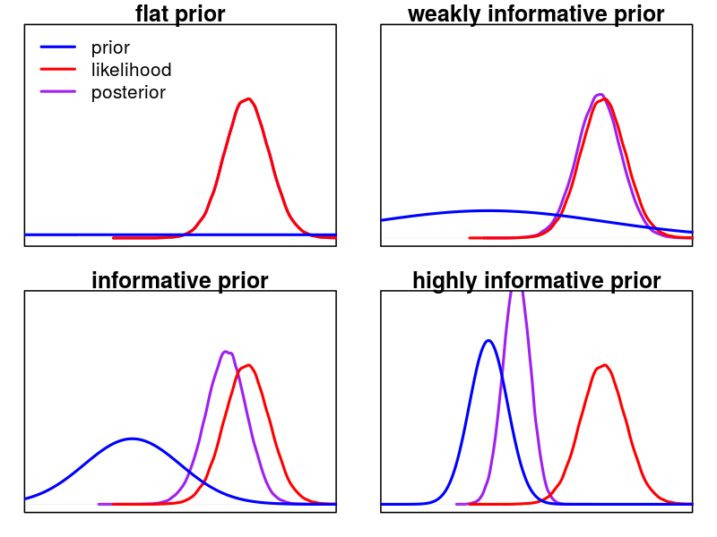
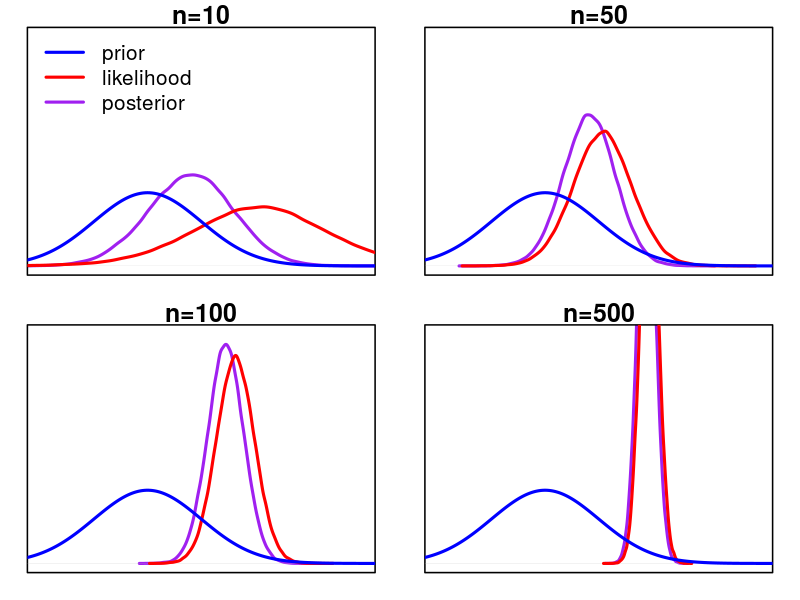

```{r setup, include=FALSE}
knitr::opts_chunk$set(echo = FALSE)
```


## Bayes rule

posterior is proportional to ("$\varpropto$") prior times likelihood!

$$p(\theta|y)\varpropto p(\theta)\cdot p(y|\theta)$$


```{r posterior, fig.height=4.5, fig.width=6, fig.align="left"}
x=seq(-10,10, by=0.01)
prior=dnorm(x, mean=0, sd=4)
likelihood=dnorm(x, mean=2, sd=1.5)
par(mfrow=c(1,1), mar=c(4,4,1,1), oma=c(1,0,0,0))
plot(x,prior, type="l", col="blue", ylim=c(0,0.3), lwd=2, lty=2, xlab=expression(theta), ylab=("density"))
lines(x,likelihood, col="red", lwd=2, lty=2)
lines(x,prior*likelihood/sum(prior*likelihood)*100, col="purple", lwd=2)
legend("topleft",legend=c("prior", "likelihood", "posterior"), lty=c(1,1,1), lwd=c(2,2,2), col=c("blue","red","purple"))
```

## Bayes rule

posterior is proportional to ("$\varpropto$") prior times likelihood!

$$p(\theta|y)\varpropto p(\theta)\cdot p(y|\theta)$$

- prior: a-priori information of the model parameters
- likelihood: information of the data
- posterior: updated information of the model parameters given the data

## Prior information

- prior represents information or belief about the parameters 
- ... before we look at the actual data $y$!
- **do not** use data statistics (e.g. $\text{mean}(y)$) for prior choice
- data information is already contained in the likelihood!
- use information from   
    - general expectation / reasonable range
    - previous experiments  
    - related studies in literature  

## Types of priors 

- flat prior / uninformative prior  
    + you know absolutely nothing about the parameters
    + but this is rarely the case!

- weakly informative prior   
    + you have a general idea, e.g. about the order of magnitude

- informative prior   
    + you have a good idea about the parameter

- There is no formal definition of these terms.
     https://github.com/stan-dev/stan/wiki/Prior-Choice-Recommendations

## Influence of prior distribution

change standard deviation of prior distribution (on same data)

```{r, out.height = "500px"}

```

## Influence of sample size

change sample size (same prior)

```{r, out.height = "500px"}

```

## Are priors subjective?

- Assuming **no information** about parameters is also a choice!
- For **weakly informative** priors (credibility spread across wide range in parameter space), even little data dominates the posterior.
- In the presence of **strongly informative** priors (e.g. previous study with a lot of power), it takes a lot of new data to update prior belief.

Or, from a different perspective

- **small sample size / little evidence**:   
    prior distribution dominates the posterior  
- **large sample size / strong evidence**:   
    likelihood function dominates the posterior

