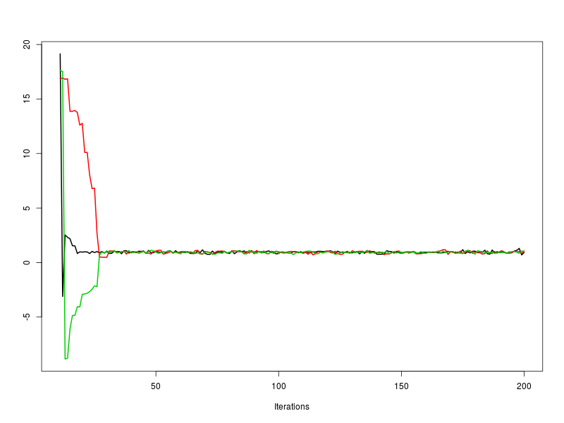
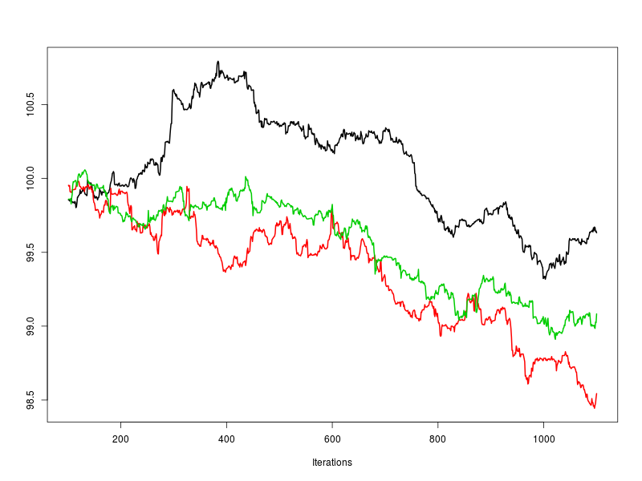
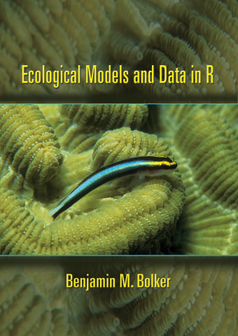
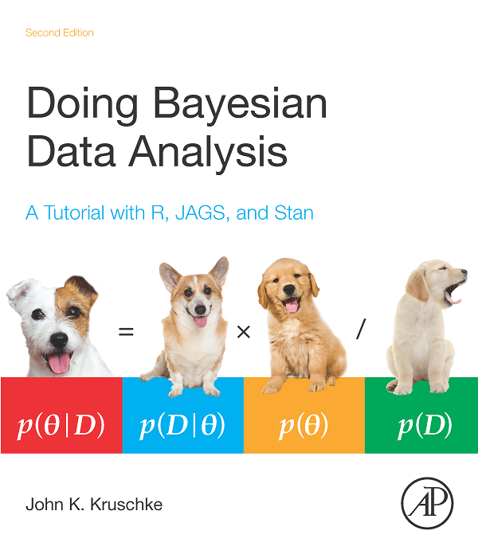
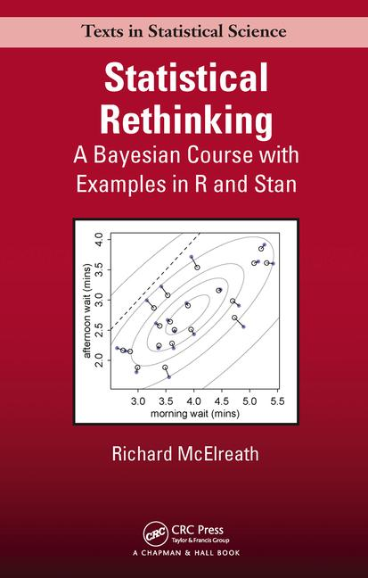
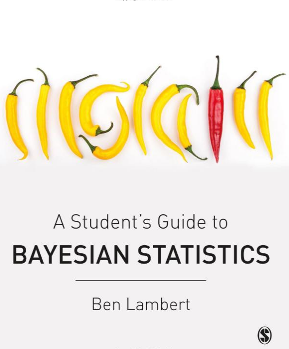
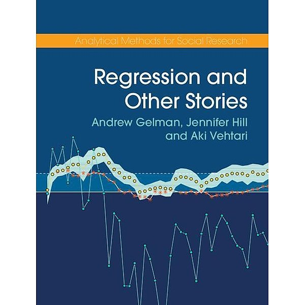

```{r setup, include=FALSE}
knitr::opts_chunk$set(echo = FALSE)
```


## Conclusions

### **Bayesian workflow**

### some resources

## Bayesian workflow

1. model specification (likelihood, priors)
2. model coding
3. [ fit model to simulated data for validation ]
4. fit model to experimental data
5. check convergence
6. posterior predictive checks
7. inference


## 1. model specification 

### **likelihood function**

- determinstic part
- stochastic part:  
  how are the data distributed w.r.t. the deterministic part?

### **prior distribution**

- what are the model parameters?
- do I have some prior knowledge?   
  general expectation, expert knowledge, previous studies, ...
- define weakly informative or informative priors   
  try avoiding flat priors!
- <font size="4">https://github.com/stan-dev/stan/wiki/Prior-Choice-Recommendations</font> 

## 2. model coding

- start small!
- for a complex model, do not code the whole thing at once
- begin with few predictors / only main effects without interactions / one hierarchy level or fixed effects / ...
- ... and work your way up

## 3. [ fit model to simulated data ]

- for complex models  
    (nonlinear, hierarchical, mainy predictors, ...)
- generate dummy data from your model with **known parameters**
- try fitting the model to this simulated data
- see if true parameters can be recovered  
    (check model **identifiablity**)

## 4. fit model to experimental data

- run several chains in parallel
- usually 3-5 chains 
- running 100 short chains (same total number of samples)  
    in parallel on a server doesn't make much sense
- you can also provide initial values for parameters  
    (was not used in this course)

## 5. check convergence

- warmup long enough?
- check `R_hat`, should be smaller than `1.01`
- check `n_eff` compared to `n_total`
- visual inspection of the chains 
- take warning messages seriously!  
  `check_hmc_diagnostics(fit)`   
  <font size="5">https://mc-stan.org/misc/warnings.html</font> 

## 5. check convergence

```{r, out.height = "450px"}

```

warmup too short

## 5. check convergence

```{r, out.height = "450px"}

```

bad mixing, model misspecified

## 6. posterior predictive checks

- generate model predictions from the posterior  
  after fitting OR while fitting (`generated quantities{}` block)
- do not use mean values of parameters for prediction  
  $\text{mean}(f(x))\neq f(\text{mean}(x))$
- remember: everything is a distribution!!
- credible / confidence and prediction intervals  
    - credible intervals for the deterministic model part
    - prediction intervals for the data include also stochastic model part
- observed vs. predicted plots

## 7. inference

- What do the data tell me about my model?
- Answer questions like:  
  Do I have a positive effect? $P(\theta>0)$  
  Does group 1 have a larger effect than group 2? $P(\theta_1>\theta_2)$
- model comparison: see `loo` package  
  <font size="4">https://cran.r-project.org/web/packages/loo/vignettes/loo2-with-rstan.html</font> 
  

## Conclusions

### Bayesian workflow

### **some resources**


## Resources: websites

- `rstan` vignettes  
  <font size="4">https://cran.r-project.org/web/packages/rstan/vignettes/rstan.html</font>  
  <font size="4">https://cran.r-project.org/web/packages/rstan/vignettes/stanfit-objects.html</font>  
- `Stan` homepage:  
  user's guide, language manual, case studies, tutorials  
  <font size="4">https://mc-stan.org/users/documentation/</font>  
- `Stan` youtube channel:  
   <font size="4">https://www.youtube.com/channel/UCwgN5srGpBH4M-Zc2cAluOA</font>
- `Stan` forums  
  <font size="4">https://discourse.mc-stan.org/</font>   
- Michael Betancourt's writings, e.g.      
  <font size="4">https://betanalpha.github.io/assets/case_studies/stan_intro.html</font>  
- `Stan` ecology community   
  <font size="4">https://stanecology.github.io/</font>  


## Resources: R packages
  
- `brms`: fit Stan models just like `lm`,`lmer`,...   
  <font size="4">https://mc-stan.org/users/interfaces/brms.html</font>  
```{r, echo=TRUE, eval=FALSE}
   fit = brm(y ~ x1 + x2 + (1|group), ...)
```
similar front-end packages:  

- `blme`: maximum a posteriori estimation   
  <font size="4">https://cran.r-project.org/web/packages/blme/index.html</font>  
- `rstanarm`: precompiled Stan models    
  <font size="4">https://mc-stan.org/users/interfaces/rstanarm</font>  
- `rethinking`: accompanies McElreath's "Statistical Rethinking" book   
  <font size="4">https://github.com/rmcelreath/rethinking</font>  
  
## Resources: books

```{r, out.height = "400px"}
knitr::include_graphics("pics/kery.jpeg")
```

## Resources: books

```{r, out.height = "400px"}

```

## Resources: books

```{r, out.height = "400px"}

```

## Resources: books

```{r, out.height = "400px"}
knitr::include_graphics("pics/gelman_hill.gif")
```

## Resources: books

```{r, out.height = "400px"}
knitr::include_graphics("pics/bda.png")
```

## Resources: books

```{r, out.height = "400px"}

```

https://github.com/rmcelreath/statrethinking_winter2019

## Resources: books

```{r, out.height = "400px"}

```

## Resources: books

```{r, out.height = "400px"}

```

## Theory consultation hour

- Theory in Biodiversity Science group (TiBS) provides consultation in theory, maths and statistics. 
- each Wednesday after the seminar
- write me an email with a brief description of your problem   
  benjamin.rosenbaum@idiv.de 


## Save the date!

### 15 November, 1 pm (Niche)

- bring your own model!
- briefly present your first model / work in progress / problem
- group discussions

## That's it!

### Good luck with your own models!
